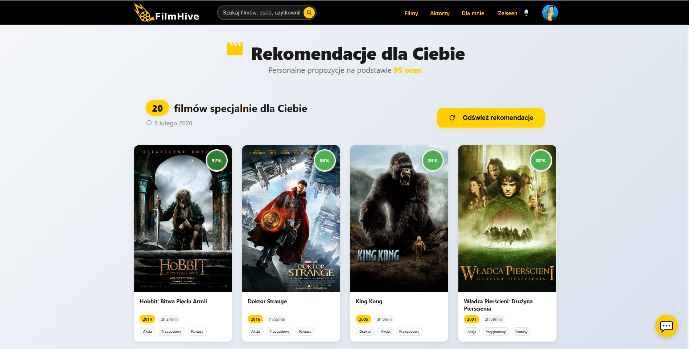
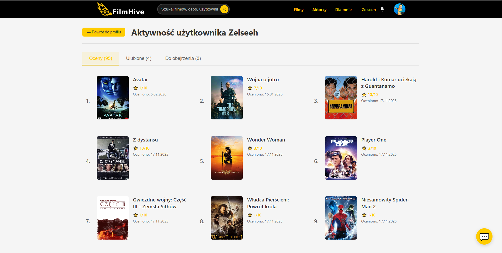
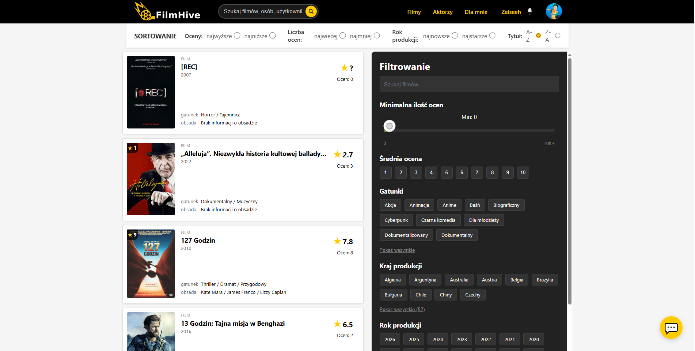

FilmHive - System Rekomendacji Filmów (Praca Inżynierska)
FilmHive to zaawansowana aplikacja webowa do spersonalizowanych rekomendacji filmowych, stworzona w ramach pracy inżynierskiej na kierunku Informatyka. System wykorzystuje hybrydowy algorytm ML (k-NN + Naive Bayes) oparty na podejściu Pazzaniego i Billsusa do filtrowania content-based.
​

Przegląd Aplikacji (Sneak Peek)

   
 
   

Aplikacja oferuje ocenianie filmów, listy osobiste, komentarze, asystenta AI (Gemini) oraz panele admin/moderator. Intuicyjny interfejs React zapewnia płynne doświadczenie na wszystkich urządzeniach.
​

Funkcjonalności
Rekomendacje: Top 20 filmów z score dopasowania (adaptacyjne wagi: gatunki 30%, aktorzy 25%, etc.)

Asystent filmowy: AI Gemini pomaga w wyborze na podstawie preferencji

Społeczność: Komentarze z powiadomieniami, oceny 1-10, listy "Ulubione"/"Do obejrzenia"

Zarządzanie: Moderatorzy dodają/edytują filmy, aktorów, gatunki

Wyszukiwanie: Filtrowanie po gatunkach, aktorach, roku, ocenach + trailery

| Warstwa     | Technologie                                                                                     |
| ----------- | ----------------------------------------------------------------------------------------------- |
| Backend     | Python 3.x, Flask, SQLAlchemy ORM, Alembic (migracje), scikit-learn (ML), JWT auth              |
| Frontend    | React + TypeScript, Bootstrap 5, React Router v6                                                |
| Baza danych | PostgreSQL (relacyjna struktura z 20+ tabelami, relacje many-to-many)                           |
| AI/ML       | TF-IDF + Stemming (polski), k-NN (podobieństwo kosinusowe), Naive Bayes (multinomial/Bernoulli) |
| Inne        | Google Gemini 2.0 Flash (asystent), NLTK (NLP), Axios/Fetch (API)                               |
​

Algorytm Rekomendacyjny
Hybryda content-based (Pazzani & Billsus):

Profil użytkownika: Wektory z ocen (strukturalne cechy + TF-IDF opisów)

k-NN: Kosinusowe podobieństwo, k=15 sasiadów

Naive Bayes: P(multinomial) dla opisów PL

Fuzja: 65% k-NN + 35% NB + MMR (różnorodność)

​
