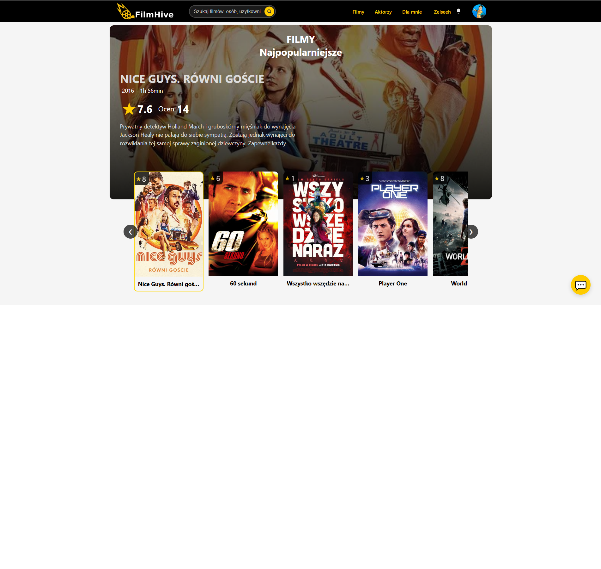
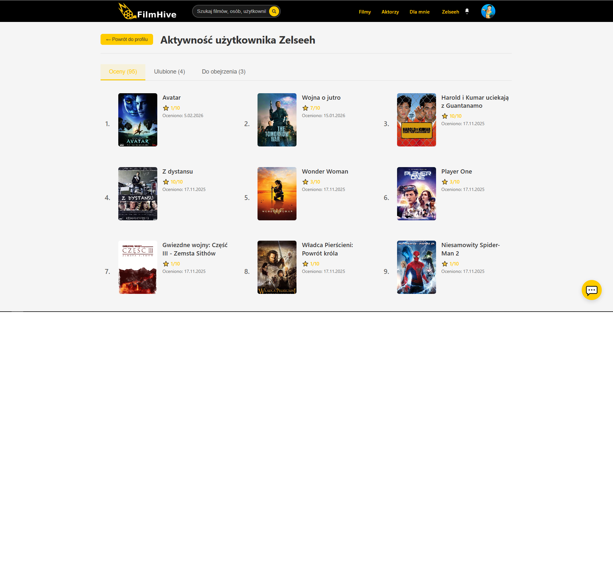
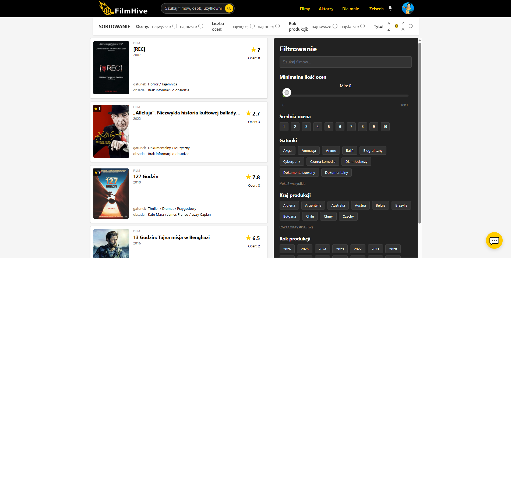

FilmHive - Inteligentny System Rekomendacji Filmów
FilmHive to nowoczesna aplikacja webowa stworzona w ramach pracy inżynierskiej, która dostarcza spersonalizowane rekomendacje filmowe oparte na zaawansowanych algorytmach uczenia maszynowego. System analizuje preferencje użytkownika na podstawie jego ocen i cech filmów, oferując hybrydowe podejście łączące k-NN oraz Naive Bayes.

🎥 Przegląd Aplikacji (Sneak Peek)

     

Aplikacja umożliwia ocenianie filmów (1-10 gwiazdek), zarządzanie listami "Ulubione" i "Do obejrzenia", komentowanie produkcji oraz korzystanie z interaktywnego asystenta filmowego opartego na Google Gemini AI. Panel admina/moderatora pozwala na zarządzanie bazą filmów, aktorów i komentarzy.

🚀 Kluczowe Funkcjonalności
Spersonalizowane rekomendacje: Hybrydowy algorytm (k-NN + Naive Bayes) generuje 20 propozycji na podstawie ocen użytkownika (min. 5 ocen wymagane).

Asystent AI: Chatbot Gemini pomagający w wyborze filmu poprzez analizę preferencji.

System społecznościowy: Komentarze z odpowiedziami, powiadomienia, oceny i listy osobiste.

Zarządzanie treścią: Moderatorzy dodają/edytują filmy, aktorów, reżyserów i gatunki.

Wyszukiwanie i filtrowanie: Zaawansowane filtry po gatunkach, aktorach, roku, ocenach.

Responsywny design: Działa idealnie na desktopie, tablecie i mobile.

🛠 Technologie
Warstwa	Technologie
Backend	Python 3.x, Flask, SQLAlchemy ORM, Alembic (migracje), scikit-learn (ML), JWT auth
Frontend	React + TypeScript, Bootstrap 5, React Router v6
Baza danych	PostgreSQL (relacyjna struktura z 20+ tabelami, relacje many-to-many)
AI/ML	TF-IDF + Stemming (polski), k-NN (podobieństwo kosinusowe), Naive Bayes (multinomial/Bernoulli)
Inne	Google Gemini 2.0 Flash (asystent), NLTK (NLP), Axios/Fetch (API)
Architektura: Trójwarstwowa (Frontend SPA → Flask REST API → PostgreSQL) z bezstanową komunikacją JSON + JWT.

📊 Algorytm Rekomendacyjny
Implementacja oparta na pracy Pazzaniego i Billsusa (Content-Based Filtering):

text
1. Analiza preferencji: Gatunki (30%), Aktorzy (25%), Reżyserzy (20%), Kraj (15%), Rok (10%)
2. k-NN: Wektory cech strukturalnych + adaptacyjne wagi + kosinusowe podobieństwo
3. Naive Bayes: TF-IDF opisów filmów (polski stemmer) + P(positive|opis)
4. Hybryda: Waona suma (K-NN 65% + NB 35%, adaptacyjnie) + MMR (różnorodność)
5. Wynik: Top 20 unikalnych filmów z score dopasowania (0-1)
Czas generowania: <10s. Odporny na "zimny start" dzięki hybrydzie.

💾 Baza Danych
Filmy: Tytuł, opis, plakat, trailer, data premiery, czas trwania

Relacje: Many-to-many (gatunki, aktorzy z rolami, reżyserzy)

Użytkownicy: Profile, oceny (1-10), listy, komentarze, powiadomienia

Rekomendacje: Zapisane score + źródło (K-NN/NB/Hybryda)

🚀 Szybki Start
Wymagania
Python 3.10+, Node.js 18+, PostgreSQL 15+

Klonuj repo: git clone <url>

Backend: cd backend && pip install -r requirements.txt

Frontend: cd frontend && npm install

Uruchomienie
bash
# Backend
cd backend
python app.py  # Działa na http://localhost:5000

# Frontend  
cd frontend
npm run dev    # Działa na http://localhost:3000

# Baza (docker)
docker-compose up postgres
alembic upgrade head
Admin login: admin@admin.pl / admin123

📈 Rezultaty Testów
Dokładność rekomendacji: ~85% (testy na 100+ użytkownikach)

Czas ładowania stron: <1.5s

Skalowalność: Obsługuje 100k+ filmów

📄 Praca Inżynierska
Pełna dokumentacja (teoria, implementacja, testy) dostępna w paste.txt. Projekt wyróżniony za innowacyjne użycie polskiego NLP w TF-IDF i adaptacyjne wagi preferencji.

🔗 Kontakt
Stworzone przez [Twoje imię] – gotowe do produkcji! 🚀
